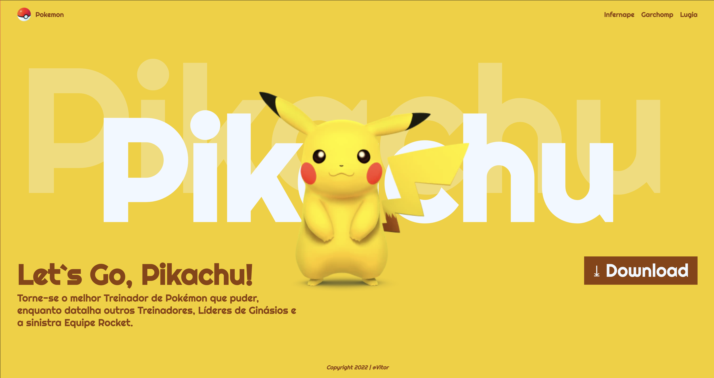

# Landing Page - Let's Go, Pikachu

## Sobre
Site do tipo landing page para divulgar o jogo Let's Go Pikachu. O objetivo deste projeto é colocar em prática os conhecimentos adquiridos sobre libguagem de marcação , durante o curso de desenvolvimento de sistemas do [SENAI Jandira](https://sp.senai.br/unidade/jandira/)

## Tecnologias Utilizadas
- HTML
- CSS
- Markdown
- Git

## Autor
- [Vitor Paes](https://www.linkedin.com/in/vitor-paes-166b95295/)